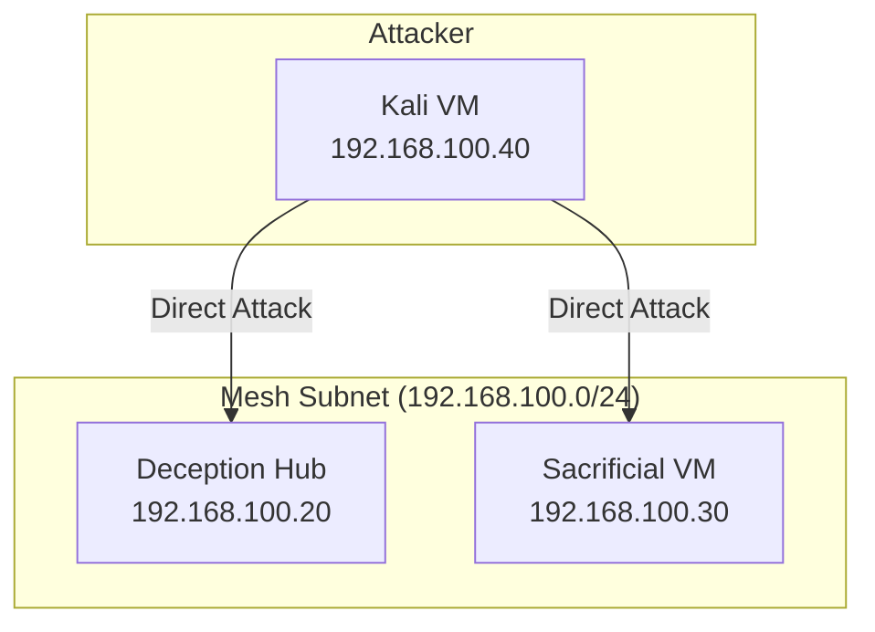

# Attacker VM (Kali Linux) — Network Setup Guide

This guide outlines how to configure the network settings on your **Kali Linux** virtual machine in VirtualBox to integrate it into the Deception Lab.

## 1. VirtualBox VM Settings

Before starting the Kali VM, configure its network adapters in VirtualBox to ensure it can reach the target network and download packages when needed.

| Adapter | Attached To | Purpose | Configuration Details |
| :--- | :--- | :--- | :--- |
| **Adapter 1** | **Host-Only Adapter** (or Internal Network) | **Mesh Network (Lab)** | Select the same adapter/network that the Deception Hub (`192.168.100.20`) and Sacrificial VM (`192.168.100.30`) are attached to. This represents the simulated corporate network. |
| **Adapter 2** | **NAT** | **Internet Access (Optional)** | Enables you to update Kali, install tools (`nmap`, `hydra`, etc.), and access external resources. Traffic is routed separately from the lab subnet. |

---

## 2. Kali OS Network Configuration

The Kali VM needs a static IP on the Mesh network to ensure consistent targeting and log correlation.

* **Mesh Subnet IP:** `192.168.100.40/24` (or any free IP on `192.168.100.0/24` except `.20` and `.30`)

### Option A: Automate using the Setup Script

We have provided a script to automate this setup using either NetworkManager (`nmcli`) or `/etc/network/interfaces`.

1. Copy the script [setup_kali.sh](file:///c:/PROJECTS/Honeypot/vm_configs/attacker-kali/setup_kali.sh) to your Kali VM.
2. Run it with root privileges:
   ```bash
   sudo chmod +x setup_kali.sh
   sudo ./setup_kali.sh
   ```
3. Follow the prompt to select the correct interface corresponding to your **Mesh network adapter** (the Host-Only interface on the `192.168.100.x` subnet).

### Option B: Manual NetworkManager Configuration (CLI)

If you prefer to configure this manually using `nmcli`:

1. Identify the connection name of your Mesh interface (e.g. `eth0` or `Wired connection 1`):
   ```bash
   nmcli connection show
   ```
2. Configure static IP address settings:
   ```bash
   nmcli connection modify "Wired connection 1" ipv4.addresses 192.168.100.40/24
   nmcli connection modify "Wired connection 1" ipv4.method manual
   ```
3. Bring the connection up:
   ```bash
   nmcli connection up "Wired connection 1"
   ```

---

## 3. Network Architecture Visualization

Here is how traffic flows from the Kali VM to the target networks:



---

## 4. Verification & Testing

Verify that connectivity is working properly from your Kali VM:

### 1. Test Mesh Connectivity
Ping the Deception Hub and Sacrificial VM:
```bash
ping -c 3 192.168.100.20
ping -c 3 192.168.100.30
```

### 2. Trigger OpenCanary / Cowrie
Ensure you can reach the honeypots from Kali:
* **Cowrie (SSH):** Attempt connection: `ssh admin@192.168.100.20` (should drop into Cowrie's fake shell).
* **OpenCanary (HTTP):** Curl the web server: `curl -I http://192.168.100.20/` (should show Apache banner).
* **OpenCanary (Samba):** List SMB shares: `smbclient -L //192.168.100.20/ -N` (should show the `finance` share).
